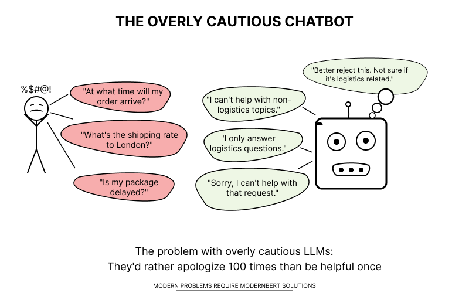

# 为大型语言模型打造高效“过滤器”：微调ModernBERT

本仓库包含实现博客文章[为大型语言模型打造高效“过滤器”：微调ModernBERT]中描述的方法的代码。

## 概述

本项目展示了如何使用ModernBERT创建一个轻量级、高效的查询过滤系统，ModernBERT是一个仅有3.95亿参数的编码器模型。与依赖昂贵的基于LLM的过滤解决方案相比，这种方法在显著降低计算需求和加快推理时间的同时，实现了类似的性能。

物流公司需要过滤掉客户服务聊天机器人收到的与主题无关的查询，同时允许合法的物流问题通过。



## 仓库结构

- **data_process/**
  - `1_dataset_generation.py`: 使用DeepSeek V3生成多样化的物流相关和非物流相关查询数据集
  - `2_dataset_review.py`: 使用DeepSeek R1验证和审查生成的数据集
- **model_train/**
  - `3_modern_bert_finetune.py`: 在验证过的数据集上微调ModernBERT
- **inference/**
  - `4_inference.py`: 测试和评估微调后的模型，包括时间基准测试
- **data/**: 包含项目使用的数据集文件 (例如 `dataset.xlsx`, `questions_sample_2k.xlsx`, `rev_guardrail_r1.xlsx`)
- **images/**: 包含README中使用的图片 (例如 `1_main.png`)
- **modernbert-llm-router/**: 包含微调后的模型文件和配置 (此目录为模型输出目录，通常在运行推理脚本后生成或手动创建以存放模型)
- `README.md`: 本文档
- `pyproject.toml`: 项目依赖和配置管理文件
- `.gitignore`: 指定Git应忽略的未跟踪文件

## 关键特性

- **高效的数据集生成**: 创建多样化、平衡的相关（物流）和非相关查询数据集
- **数据集验证**: 使用高质量LLM（DeepSeek R1）验证分类
- **轻量级微调**: 在消费级硬件上15分钟内完成ModernBERT的微调
- **快速推理**: 每个查询实现约30毫秒的推理时间，而基于LLM的替代方案约为1000毫秒
- **高准确率**: 在测试数据集上达到99.1%的F1分数，与更大的模型相当

## 使用方法

### 要求

所有依赖项都在`pyproject.toml`文件中指定，因此您不需要手动安装它们。只需按照下面的设置说明操作即可。

### 设置

1. 克隆此仓库
2. 使用uv安装依赖项：`uv sync`
3. 在`.env`文件中设置环境变量：
   - `hf_token`：您的Hugging Face访问令牌
   - `api_key`：您的LLM服务API密钥（例如，Fireworks AI）

### 运行脚本

脚本应按顺序运行：

1. 首先使用`data_process/1_dataset_generation.py`生成数据集
2. 使用`data_process/2_dataset_review.py`验证数据集
3. 使用`model_train/3_modern_bert_finetune.py`微调ModernBERT
4. 使用`inference/4_inference.py`测试和评估

## 结果

微调后的模型实现：

- 在测试数据集上达到99.1%的F1分数
- 每个查询约30毫秒的推理时间
- 成功识别越狱尝试和与主题无关的查询
- 准确分类合法的物流问题

## 模型使用

微调后，您可以使用几行代码进行推理：

```python
from transformers import pipeline

# 加载模型
classifier = pipeline("sentiment-analysis", model="modernbert-llm-router")

# 检查查询是否与物流相关
query = "What is the status of my package?"
result = classifier(query)
print(result)  # [{'label': 'True', 'score': 0.9997}]

# 检查与主题无关的查询
query = "Can you write me a Python script to analyze data?"
result = classifier(query)
print(result)  # [{'label': 'False', 'score': 0.9998}]
```

## 许可证

本项目采用Apache 2.0许可证。

## 致谢

- ModernBERT由[Answer.ai](https://huggingface.co/answerdotai/ModernBERT-base)提供
- 用于数据集生成和验证的DeepSeek模型
